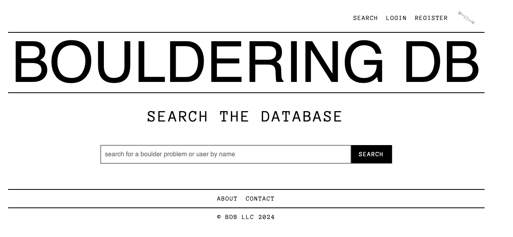

# Bouldering DB Project

Welcome to the Bouldering DB project! This web application is designed to help climbers share and discover boulder problems from around the world. The platform allows users to create profiles, log boulder problems, search for climbs, and connect with other climbers.

## Table of Contents

- [Homepage](#homepage)
- [Search Page](#search-page)
- [Login Page](#login-page)
- [Register Page](#register-page)
- [Profile Page](#profile-page)
- [Add Boulder Problem Page](#add-boulder-problem-page)
- [Boulder Page](#boulder-page)
- [Admin Dashboard](#admin-dashboard)
- [Preliminary Database Schema](#preliminary-database-schema)

## Homepage

The homepage of Bouldering DB features a selection of highlighted boulder problems from various locations. Users can access the main functions of the site, including search, login, and registration, from this page. Users can also click through featured main images to see different "magazine covers", and greyed out featured boulder problems (which are randomized from the database pool on page load) below will colorize on hover and take users to relevant boulder page on click.

## Search Page

The search page allows users to search for boulder problems or other users by name. Simply enter a search term in the input field and press the "SEARCH" button to view results.

## Login Page

Users can log in to their Bouldering DB account through this page. Once logged in, users gain access to their profile and the ability to add or edit boulders in the database via a dropdown Midnight Lightning symbol. If you don't have an account, a link is provided to register.

## Register Page

New users can sign up for Bouldering DB on this page. You'll be asked to provide information such as your name, email, and password. Additional optional fields allow you to share more data to the database. The more users share, the more robust a database can be built which will ultimately help users find more boulder problems that suit their style, strengths, preferences, etc.

## Profile Page

The profile page displays user information such as name, age, height, climbing style, and favorite bouldering locations. Users can also edit their profile details here. By providing detailed information, other users will be able to track climbers with similar styles, and preferences in order to more effectively discover compatible boulder problems.

## Add Boulder Problem Page

This page allows users to contribute to the Bouldering DB by adding new boulder problems. Users can provide details such as the problem's name, location, first ascensionist, grade, and history. Users greatly encouraged to upload high-quality, well-framed images of boulder problems in order to showcase the experience for other climbers in the best light possible. The form input fields have been painstakingly refined to attempt to collect and provide as concise and informative data to prospective climbers, allowing users to have a more personalized, deeper experience with the database. While grades can be helpful for gauging the challenge of a boulder problem, they are arguably the most insignificant part of the whole story. Thus, on Bouldering DB grades are "proposed" and will be averaged over time based on user input. There is no such thing as a V15. There is only a subjective experience that is being forcefully translated into an arbitrary number. While helpful for gauging challenges, attachment to this arbitrary number can severely limit our climbing experiences and thus this database will not display them as prominent, static information.

## Boulder Page

Once boulder problems are submitted to the database, users can view them here and see all database information displayed cleanly and concisely. Beta (comments, videos, etc.) is hidden by default in order to protect climbers who want an onsight experience. Only registered/logged-in (authorized) users can edit a boulder page or add a comment. A location feature is currently in development which will allow users to see GPS coordinates on a map and send a link of the map to themselves in preparation for trips or on the fly (with an internet connection).

## Admin Dashboard

The site admin can view and delete all database entries on a single page. As the database grows, this dashboard will evolve for greater efficiency.

## Preliminary Database Schema

The preliminary database schema shows entity relationships. Future development will add a one-to-many relationships from boulder-problems/users to ratings and grades tables to allow all users to add their input and these metrics to be averaged over time.

## About

Bouldering DB was born out of a desire for a more streamlined and holistic boulder-problem focused experience than other current online climbing databases. It is a community-driven, UX-centered platform dedicated specifically to the world of bouldering. Bouldering DB focuses on beautiful bouldering experiences through showcasing the aesthetics and movement of a boulder problem, and collecting the appropriate data that best communicates these experiences to other passionate boulderers. Unlike databases like 8a.nu and mountainproject.com, bouldering db strives to display database information as cleanly as possible, and minimize ego-driven ticklisting and grade-chasing, instead re-focusing on the fundamentals of the climbing experience: the rock, the area, and the movement. 

## Contact

For any inquiries, please contact me at [ahocev@gmail.com](mailto:ahocev@gmail.com).

---

© BDB LLC 2024