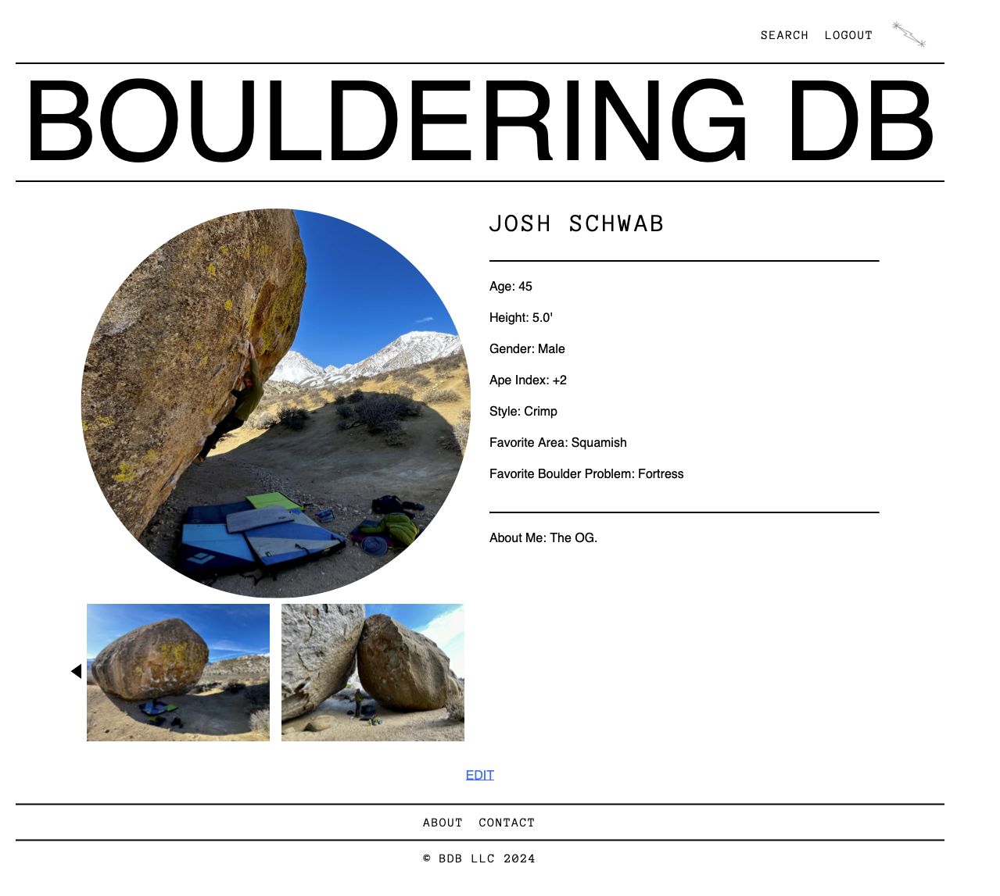
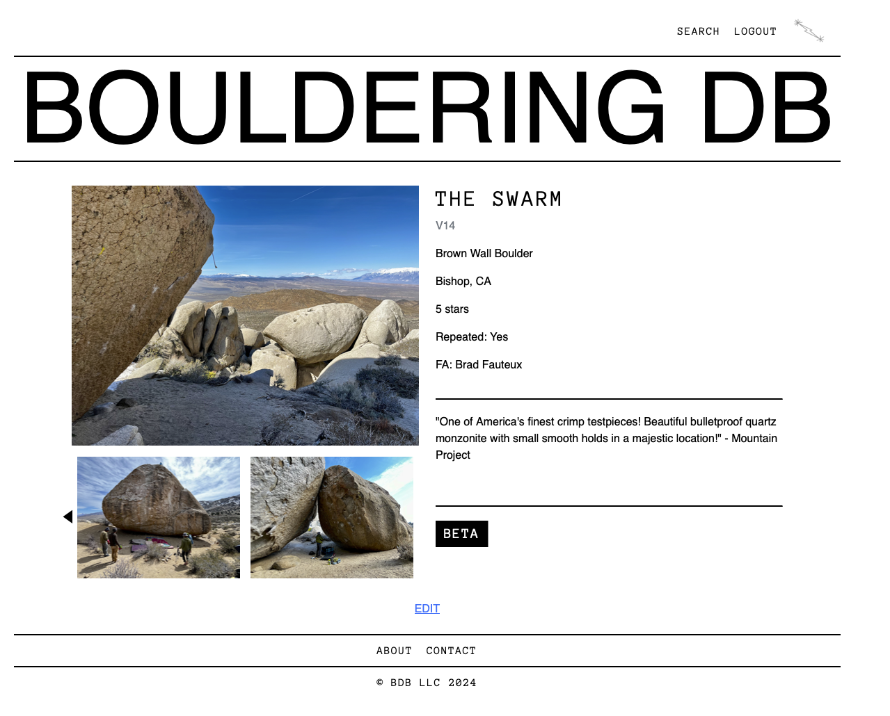

# Bouldering DB Project

Welcome to the Bouldering DB project! This web application is designed to help climbers share and discover boulder problems from around the world. The platform allows users to create profiles, log boulder problems, search for climbs, and connect with other climbers.

## Table of Contents

- [Homepage](#homepage)
- [Search Page](#search-page)
- [Login Page](#login-page)
- [Register Page](#register-page)
- [Profile Page](#profile-page)
- [Add Boulder Problem Page](#add-boulder-problem-page)
- [Boulder Page](#boulder-page)

## Homepage

The homepage of Bouldering DB features a selection of highlighted boulder problems from various locations. Users can access the main functions of the site, including search, login, and registration, from this page.

## Search Page

The search page allows users to search for boulder problems or other users by name. Simply enter a search term in the input field and press the "SEARCH" button to view results.

## Login Page

Users can log in to their Bouldering DB account through this page. Enter your registered email and password to gain access to your profile and other features of the site. If you don't have an account, a link is provided to register.

## Register Page

New users can sign up for Bouldering DB on this page. You'll be asked to provide information such as your name, email, and password. Additional optional fields allow you to share more details about yourself, which will be displayed on your profile.

## Profile Page

The profile page displays user information such as name, age, height, climbing style, and favorite bouldering locations. Users can also edit their profile details here.

## Add Boulder Problem Page

This page allows users to contribute to the Bouldering DB by adding new boulder problems. Provide details such as the problem's name, location, first ascensionist, grade, and history. Users can also upload an image to showcase the problem.

## Boulder Page

Once boulder problems are submitted to the database, users can view them here and see all database information displayed cleanly and concisely. Beta (comments, etc.) is hidden by default in order to protect climbers who want an onsight experience. Only registered/logged-in (authorized) users can edit a boulder page.

## About

Bouldering DB was born out of a desire for a more streamlined and boulder-problem focused experience than other current online climbing databases. It is a community-driven, UX-centered platform dedicated specifically to the world of bouldering. Bouldering DB focuses on beautiful bouldering experiences through showcasing the aesthetics and movement of a boulder problem, and collecting the appropriate data that best communicates these experiences to other passionate boulderers. Unlike databases like 8a.nu and mountainproject.com, bouldering db strives to display database information as cleanly as possible, and minimize ego-driven ticklisting and grade-chasing, instead re-focusing on the fundamentals: the rock, the area, and the climbing experience. 

## Contact

For any inquiries, please contact us at [ahocev@gmail.com](mailto:ahocev@gmail.com).

---

© BDB LLC 2024